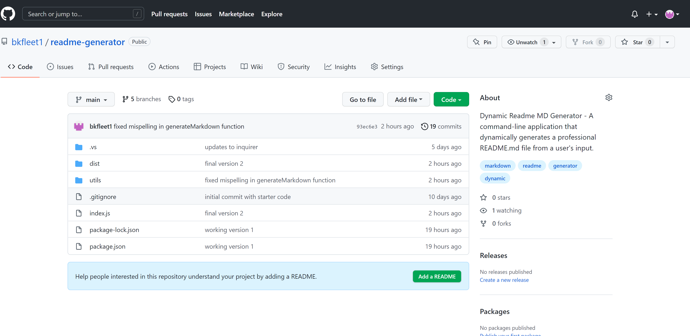
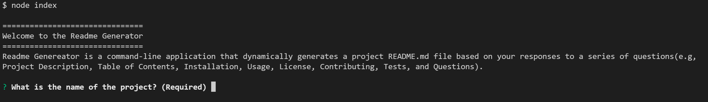

# [Dynamic Readme MD Generator](#title)

## [Description](#description)
A command-line application that dynamically generates a professional README.md file from a user's input using javascript, node js, and Inquirer.

`
>> - Project Repository URL: https://github.com/bkfleet1/readme-generator

>> - Project Video URL: https://watch.screencastify.com/v/H1glvLWBQsTvY2qrMMcy

## Table of Contents
> * [Title](#title)
> * [Description](#description)
> * [Developer](#developer)
> * [Resources](#resources)
> * [Installation](#installation) 
> * [Usage](#usage)
> * [Tests](#tests)
> * [Questions](#questions)

## [Developer](#developer)
[Brad Kelley](mailto:bradkelleytech@gmail.com)

## [Resources](#resources)
The following resources were used in the development of this project.
>> Javascript, Node.js, NPM, Inquire, node fetch, and stripchar

## [Installation](#installation)
The following steps are required to execute the Dynamic Readme MD Generator code.

> 1. Clone the repository located at: https://github.com/bkfleet1/readme-generator.
> 2. Install Node.js. You can download the latest version of Node.js at https://nodejs.org/en/ ;
> 3. Open the project in a terminal application, such as git bash, and install NPM. To install npm, simply type "npm install" and press enter. Don't close your terminal application, we have a couple more items to install;
> 4. Next install Inquirer, which is a package that enables the question prompts used to populate your readme.md file that will be generated. To install Inquirer simply type "npm i inquirer" and press enter;
> 5. Now we are going to install Node Fetch, which is an npm package that enables the API fetch features used to retrieve license choices from github. You can install node-fetch by typing "npm i node-fetch" in the command prompt;
> 6. Finally, iyou need to nstall stripchar, an npm package that removes special characters that prevent the creatiion of badges in your readme file. Simply type "npm i stripchar" and press enter.

## [Usage](#usage)
After the installation process, you can execute the application typing "node index" and press enter. You should be presented with a welcome message and prompted for the title of your project, as shown below.

The application will present you with a series of questions. The responses you provide to each question are included in the README.md file the application will generate, which you will find in the application's ./dist directory. Note that the application overwrites the content of any existing readme.md file in this directory.

It is important to note that the file being created is a markdown.md file. Thus, your responses to the application's prompts should be written in markdown syntax. You can reference the [markdown guide](https://www.markdownguide.org/basic-syntax) for basic syntax.

## [Tests](#tests)
No testing routines are relevant for this application.

## [Questions](#questions)
Please email [Brad Kelley](mailto:bradkelleytech@gmail.com) with any project questions.
